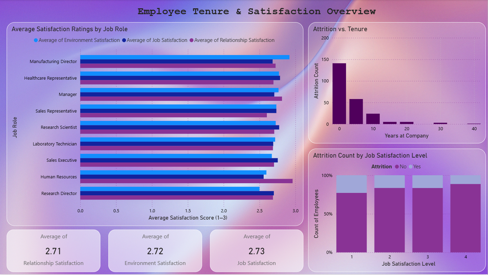

# 👥 HR Employee Attrition Dashboard in Power BI

This is my second Power BI project, where I explored and visualized HR data to better understand employee attrition patterns. The dataset comes from [IBM HR Analytics Employee Attrition & Performance](https://www.kaggle.com/datasets/pavansubhasht/ibm-hr-analytics-attrition-dataset), and the goal was to analyze key factors behind attrition such as job satisfaction, environment, department, age, and years at company.

The purpose of this project was to deepen my knowledge of Power BI by working with real-world HR data and building a professional dashboard that can help HR departments make informed decisions.

---

## 🧠 What I learned

- Loading and transforming HR data in Power BI  
- Creating calculated columns and using DAX for KPIs  
- Building interactive dashboards with drill-through pages  
- Visualizing attrition by job role, department, gender, and satisfaction  
- Using different chart types: ribbon chart, line chart, clustered bar chart, histogram  
- Working with averages and distributions  
- Customizing tooltips, formatting visuals, and improving clarity  
- Best practices for storytelling in HR analytics

---

## 📁 Files in this repo

- `HR-Employee-Attrition.csv` – the raw dataset  
- `screenshots/` – screenshots of the dashboard and visuals  
- `README.md` – this file  

---

## 📸 Dashboard Preview

### 🔹 Main Dashboard  

### 🔹 Drill-Through Page (Job Roles per Department)  

### 🔹 Satisfaction Ratings and Employee Distribution  

---

## 📊 Key Insights

- **Total Employees**: 1470  
- **Total Attrition**: 237 (≈16.1%)  
- **Attrition is highest** in the Sales department  
- Job roles like **Laboratory Technician** and **Sales Executive** show higher attrition  
- Employees with **lower satisfaction** levels tend to leave more  
- Most employees stay for **0–5 years**, with peaks at 1 and 3 years  
- **Younger employees** tend to have higher attrition

---

## 🔧 Tools Used

- Power BI Desktop  
- GitHub for version control  
- Excel/CSV for raw data handling

---

Thank you for checking out my HR analytics project!  
I'm continuously learning and improving, and I hope to find a data-related role in the near future.  
Feel free to give feedback or connect with me on [LinkedIn](#)! 🙌
