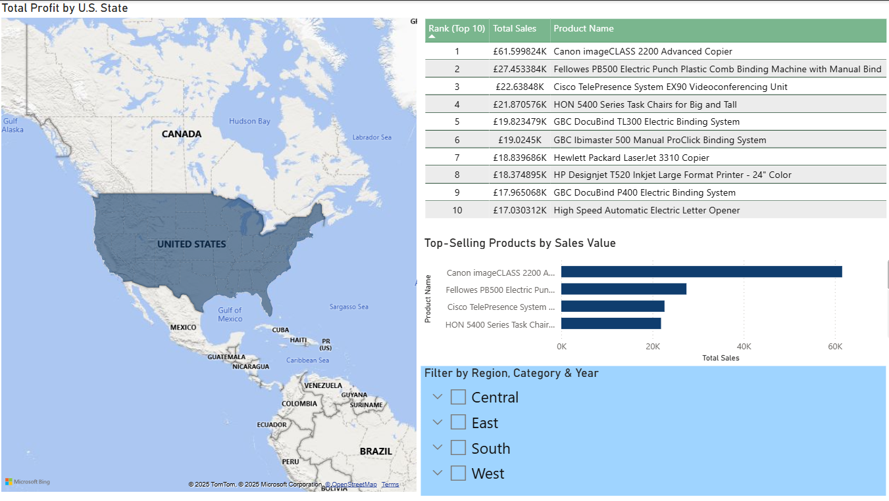

# 📊 Superstore Sales Dashboard in Power BI

This is my first Power BI project, where I explored and visualized sales data from the popular [Sample - Superstore dataset](https://www.kaggle.com/datasets/vivek468/superstore-dataset-final). The main goal of this project was to practice working with Power BI and learn how to clean, analyze, and present data visually.

## 🧠 What I learned

- Importing and transforming data in Power BI
- Working with date fields and hierarchies
- Creating KPIs using cards (e.g., Total Profit, Sales, Orders)
- Visualizing trends with line charts
- Sorting and customizing bar charts
- Simple DAX formulas
- Formatting numbers (K, M) and fixing regional settings
- Troubleshooting issues with field formatting and filters

## 📁 Files in this repo

- `Superstore-Sales-Dashboard.pbix` – the main Power BI dashboard
- `SampleSuperstore.csv` – the raw dataset
- `screenshots/` – a few screenshots of the dashboard and charts

## 📸 Dashboard Preview

## 🔧 Tools Used

- Power BI Desktop
- GitHub for version control

--

Thank you for checking out my project! 🙌
